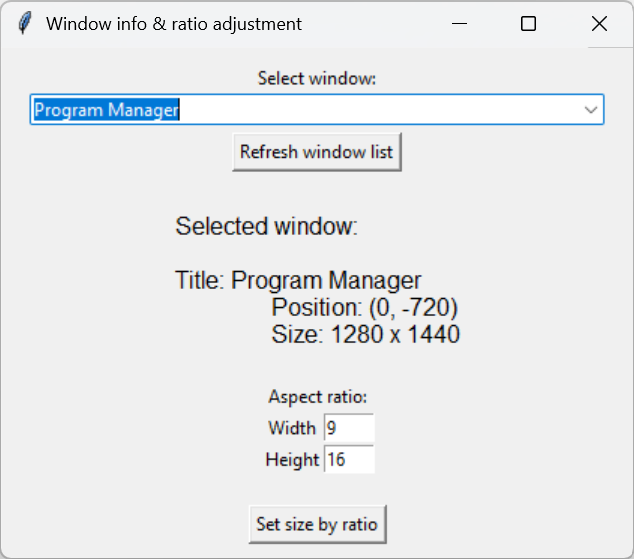

# Windows Size Tool

## ehem. Aushilfskassierer

A simple graphical user interface (GUI) tool for Windows that allows you to:

✅ List all currently open windows
✅ Select a window from the list
✅ View window title, size, and position
✅ Resize the selected window based on a custom aspect ratio

Perfect for developers, designers, or content creators who want to quickly align window dimensions to specific screen or video aspect ratios.

---

## 💻 Features

* 🪟 Lists open windows with non-empty titles
* 🔍 Live window info: position, size, and title
* 📐 Resize to custom aspect ratio (e.g., 9:16, 16:9)
* 🔁 Refresh window list at any time

---

## 📷 Screenshot



---

## 📦 Requirements

* Python 3.6+
* `pygetwindow`
* `tkinter` (comes with Python)

Install requirements via pip:

```bash
pip install pygetwindow
```

---

## 🚀 Usage

1. Run the script:

   ```bash
   python window_size_tool.py
   ```

2. The GUI will open:

   * Click **"Refresh window list"** to load current windows
   * Select a window from the dropdown
   * Set a desired **Aspect Ratio** (Width\:Height)
   * Click **"Set size by ratio"** to apply the new width
     (height stays the same)

---

## 🧠 Notes

* The tool only works for windows with visible, non-empty titles.
* The height of the window remains unchanged when resizing by aspect ratio.
* Make sure you have permission to modify the selected window (some system/privileged windows may block resizing).

---

## 🔗 Connect with me

* 🎥 [YouTube](https://www.youtube.com/@ehemAushilfskassierer)
* 📸 [Instagram](https://www.instagram.com/ehem.aushilfskassierer/)
* 🎵 [TikTok](https://www.tiktok.com/@ehem.aushilfskassierer)
* 💼 [LinkedIn](https://www.linkedin.com/in/jan-eric-keller)
* 📊 [Kaggle](https://www.kaggle.com/whatthedatahastotell)
